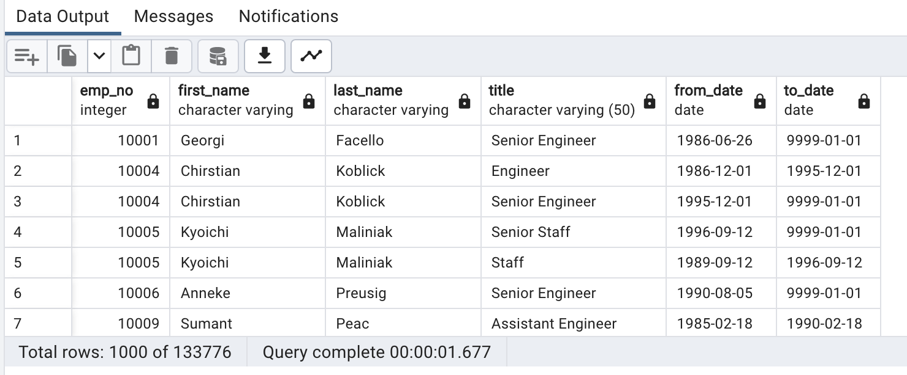
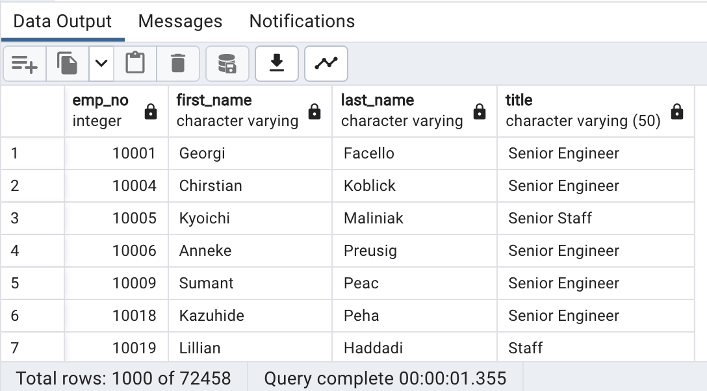
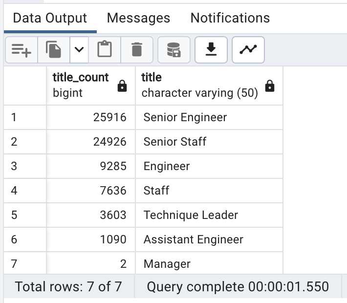
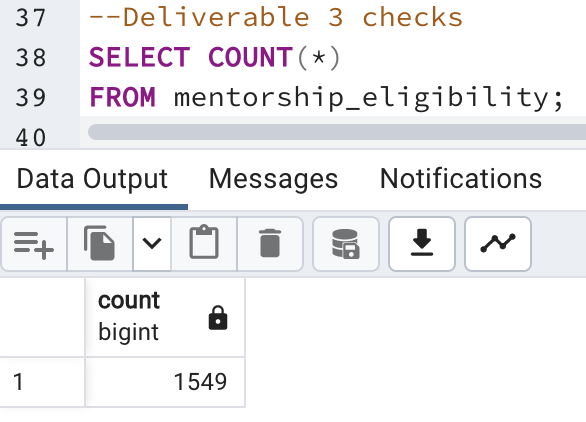

# Pewlett-Hackard-Analysis.
## Overview of the Project
This project required us to be able to find the silver tsunami of people who will be retiring soon. This is important as alot of Pewlett Hackards workforce falls within this age range. To ensure the company stays afloat, we need to use SQL to figure out the number of employees retiring. 
This also helps us determine which of the employees can assist with the newer generation in the mentorship program. 

## Results
There are around 72,500 employees which meet the Silver Tsunami age criteria and are born between the years of 1952-56. 
Senior positions are taken by 70.2% of the retiring group  
Only 1549 employees fit within the criteria of fulfilling the role of a mentor. 

## Additional Questions
1. How many roles will need to be filled as the "silver tsunami" begins to make an impact?
* Approximately 72,458 Roles need to be fulfilled

2. Are there enough qualified, retirement-ready employees in the departments to mentor the next generation of Pewlett Hackard employees?
* Unfortunately there are only 1,549 people who fit the mentorship eligibility, it is recommended to extend the birth years of applicants you are picking for this mentorship role. 

